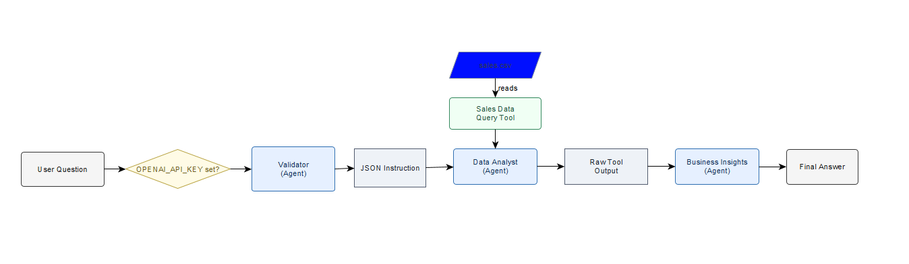

# SalesCrewPipeline

<p align="center">
  
</p>

Web UI to preview your `sales.csv`, ask questions, and see each pipeline stage:

1) **Validator** → turns your question into a compact JSON instruction  
2) **Data Analyst** → runs the instruction against the CSV  
3) **Business Analyst Insights** → summarizes the result

The UI shows: **dataset preview (left)** and **pipeline outputs (right)**.

---

## Requirements

- **Docker** (Docker Desktop on Windows/macOS, or Docker Engine on Linux)
- **Docker Compose v2**
- **Internet access**
- **OpenAI API key**
- Your dataset at `./data/sales.csv`

Python dependencies baked into the image (for reference):
- `Flask >= 3.0, < 4.0`
- `gunicorn >= 21.2`
- `python-dotenv >= 1.0`
- `pandas >= 2.2`
- `crewai >= 0.35`
- `openai >= 1`
- `pydantic >= 2`

---

## Setup

1. **Place your dataset**
   ```bash
   mkdir -p data
   # Put your CSV here
   # data/sales.csv
   ```

2. **Create your .env**
   ```env
   OPENAI_API_KEY=sk-...            # required
   SALES_CSV=/data/sales.csv        # path inside the container (matches the volume in compose)
   PORT=5000
   ```

---

## Run with Docker Compose

```bash
docker compose build
docker compose up
```
